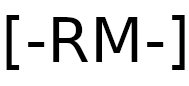

<h1 align="center">
  <br>
  <a href="https://github.com/fasalmbt/reconme"></a>
  <br>
  Reconme
  <br>
</h1>
<p align="center">
    
    
    
</p>


As the information in the internet is increasing day by day, its really a need of the hour to automate the recon process. reconme is a simple recon tool to automate the recon process.

## Features

- [x] Whois Lookup
- [x] NameServer Lookup
- [x] Robots.txt Scanner
- [x] Admin Panel Scanner
- [x] Find IP address location
- [x] TCP Port Scan
- [x] Reverse IP Scan
- [x] Forward DNS search
- [x] HTTP Headers Check
- [x] Zone Transfer
- [x] Subnet Lookup
- [x] Wayback URL
- [x] Banner grabber


## Additional Feature

- [x] You have option to filter endpoints from wayback URL's


## How to run 

```
pip3 install -r requirements.txt

python3 reconme.py
```

## Notes


Due to API limit of hackertarget API, the portscan feature is updated. Inorder to run it, you need nmap to be installed
in system. It can be installed by `sudo apt install nmap`.


